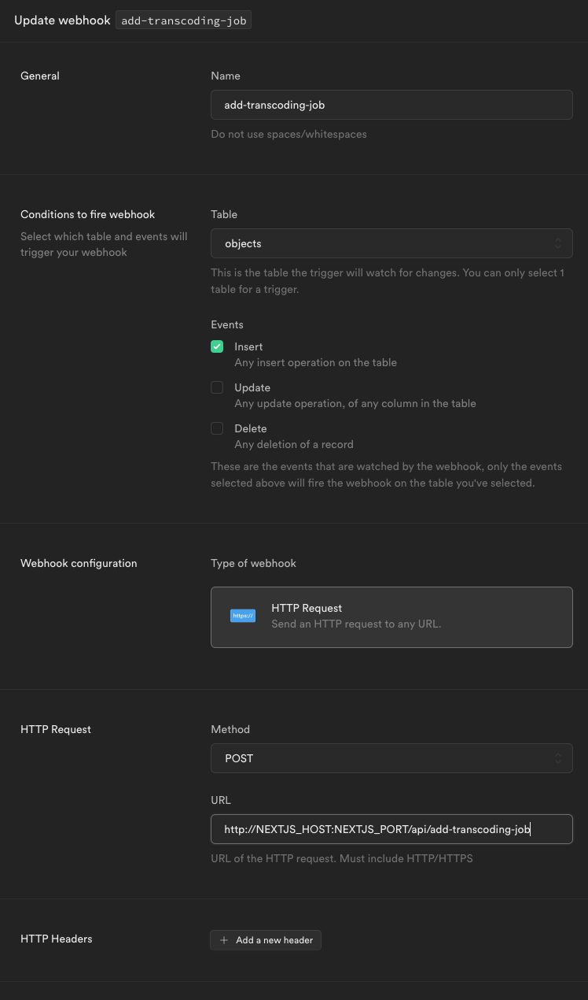

This folder contains both the frontend code and the backend relative to database access. The website uses the [T3 Stack](https://create.t3.gg/) as a base (Next.js, Prisma and tRPC), integrating it with Supabase for authentication, storage and database.

In order to properly confiure the Supabase instance (either local or cloud-hosted) it's necessary to push the schema specified in the prisma folder and run the sql code snippets in the init.sql file from the Supabase Studio dashboard. Additionally a webhook has to be configured in order to trigger the creation of a transcoding job once a video file is uploaded: this can be done from the Supabase Studio Dashboard as shown in the image below (replace NEXTJS_HOST and NEXTJS_PORT with real values, e.g. localhost:3000 if both Supabase and the NextJS web server are running locally)

As for storage, 3 buckets have to be configured:
- raw-videos
- videos (public)
- pictures (public)

NOTE: Supabase security policies for storage have to be properly configured but for development purposes access can be made open to all users.